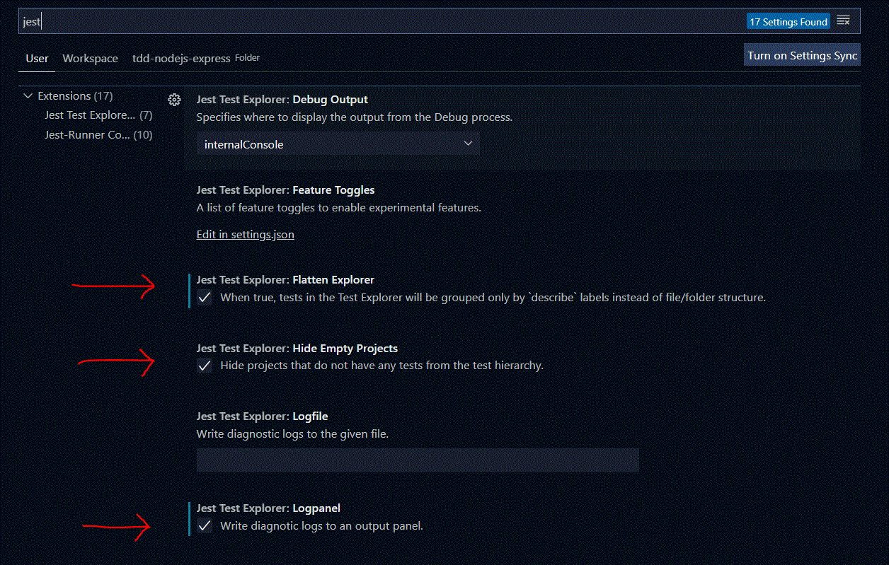
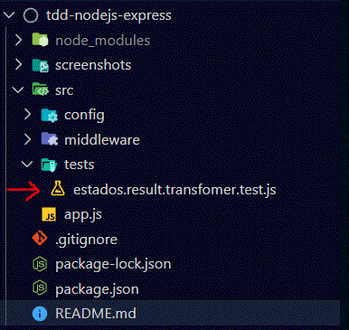

## TDD NODEJS EXPRESS

#### This is a NodeJS application that provide an exercise in a gradative way to improve your test skills using TDD practice.

### Table of Content

- [Motivation](#motivation)
- [Installation](#installation)
- [Technologies](#technologies)
- [VSCode Extensions](#vscode-extensions)
- [Let's Start !](#lets-start)
    - [The context](#the-context)
    - [The solution](#the-solution)
        - [Note to think](#note-to-think)
- [Deep Diving](#deep-diving)
    - [Writing the test](#WRITING-THE-TEST)
    - [Test Fails](#TEST-FAIL)
    - [Writing the code](#WRITING-THE-CODE)
    - [And Voilà](#AND-VOILÀ)
- [Do yourself](#DO-YOURSELF)

### Motivation

Many developers are little lazy when the subject it's about tests. Maybe they don't REALLY know about the importance of this, or they just don't know how to create good tests. Or even worse, they don't know how to start build a test nicely.

This guide it's for you, my dear Dev, and I hope that you leave with some skills to build tests like a good Dev.

We'll follow this simple image that represents the cycle of TDD and see how it works in the practice.


### Technologies

- axios
- consign
- express
- pino

- jest (dev)
- supertest (dev)
- @types/jest (dev)

### VSCode Extensions

- ESLint
- JavaScript (ES6) code snippets
- Jest Runner
- Jest Test Explorer

>**IT'S VERY RECOMMENDED INSTALL THIS EXTENSIONS TO HAVE A BETTER EXPERIENCE**

### Installation

> Clone/Checkout the `main` branch

> npm install

> (VSCODE) File > Preferences > Settings > In search settings, type **Jest**



## Let's Start !

### The Context
A client asked us to create an service exposed as an API to let us know which region is located in a Brazilian state. Our service must receive the UF (Federative Unit) and return the exactly value bellow: 

`{UF} = RJ` 

`Value to return = Rio de Janeiro (RJ) / Sudeste (SE)`.

### The Solution

We'll use the IBGE API `https://servicodados.ibge.gov.br/api/v1/localidades/estados/{UF}` to return the information of a UF. After that, we need to convert the IBGE API response to the specification above.

#### **Example**
**GET <a>https://servicodados.ibge.gov.br/api/v1/localidades/estados/RJ</a>**

##### [To see more](https://servicodados.ibge.gov.br/api/docs/localidades?versao=1#api-UFs-estadosUFGet)

**IBGE API Response (States)**
```json
{
    "id": 33,
    "sigla": "RJ",
    "nome": "Rio de Janeiro",
    "regiao": {
        "id": 3,
        "sigla": "SE",
        "nome": "Sudeste"
    }
}
```
**Our service MUST RETURN**
```json
{
    "value": "Rio de Janeiro (RJ) / Sudeste (SE)"
}
```

#### **NOTE TO THINK**
> When we look at the describe of the Solution, automatically we think "well, i need to create a client that integrates with the IBGE API and after that transform the result on a new one". Yes, that it's correct. Then we would do:
> 1. Create a client that integrates with API
> 2. Create a function with the logic of transformer/converter of IBGE API response
> 3. Create a module that integrates the items 1 and 2. So, when we use this module, we call the API with ***item 1*** and then transform the result with ***item 2***
>
> **So far so good.**
>
> But what is the real value, or in other words, what is the business rules here that we need to **pay attention**?
><br>
><br>
><br>
> I'm sure you answered: **Transformer!**

### **DEEP DIVING**

### WRITING THE TEST

#### Step 1

Create a test file named **estados.result.transformer.test.js** on the **tests** folder.




#### Step 2

**Describe the Test Suite**
```javascript
describe('Estados Result Transformer', async() => {

    
});
```

#### Step 3

**Create the test**
```javascript
describe('Estados Result Transformer', async() => {

    it('should return {"value": "State (UF) / Region (Region abbrev.)"}', async() => {

    });

});
```

#### Step 4

**Create a "*mock value*" that represents the real return of IBGE API ESTADOS**
```javascript
// GET {base_url}/estados/RJ
const defaultJsonResponse = {
    "id": 33,
    "sigla": "RJ",
    "nome": "Rio de Janeiro",
    "regiao": {
        "id": 3,
        "sigla": "SE",
        "nome": "Sudeste"
    }
};
```

#### Step 5

**Invoke a function (function, method, class, service... whatever you want) that will be return the result**

>***Yes! This function still not exists. Yet. And that is the trick.***

```javascript
//this service doesn't exists yet
const actual = ibgeEstadosResultTransformer.execute(defaultJsonResponse);
```
#### Step 6

**Now we can create an expected object that represents WHAT WE EXPECT as a success result**

```javascript
const expected = {
    value: "Rio de Janeiro (RJ) / Sudeste (SE)"
};
```

#### Step 7

**We need to create the assertion to validate the result (actual) of what we want (expected).**

```javascript
//assertions
expect(actual).toStrictEqual(expected);
```

#### *We expect that "actual" variable represents the new formated json containing the format of the above specification*

#### **AT THIS POINT, WE CREATE THE STEP "1. Write Test" OF THE TDD CYCLE. NOW, WE GO ENTER ON THE STEP 2.**

### TEST FAIL

If you install the above extensions recommended, this panel will show the described test (and all tests created by you).

Click on the left side bar icon to show the panel.


**RUN IT on the play icon.**

#### **WOW! ERROR! OF COURSE.** 


>An error occurs: *"ReferenceError: ibgeEstadosResultTransformer is not defined"*.

**And that it's right. So, let's create this reference.**

```javascript
const ibgeEstadosResultTransformer = require('../functions/ibge.estados.result.transformer');

describe('Estados Result Transformer', async() => {

    // ...

});
```

**RUN THE TEST AGAIN**

#### **ERROR! ONCE AGAIN!** 


>But it's another error. The module that we required doesn't exist.

#### **Let's create this module. BUT with no logic, for now.**

### WRITING THE CODE

#### To see how it works gradatively, we'll iterate on the step's 2 and 3. Write some code. Test this code. And repeat again.


**Content of file ibge.estados.result.transformer.js**

```javascript
const ibgeEstadosResultTransformer = {

    async execute(ibgeEstadoResponseJson){

    }

};

module.exports = ibgeEstadosResultTransformer;
```

**RUN THE TEST ONE MORE TIME**

#### **OPS! WAIT A MINUTE!** 


> Now the error occurs inside our test. Look the assertion and look the Error trace. <br>
> *Error: expect(received).toStrictEqual(expected) // deep equality <br><br>
> Expected: {"value": "Rio de Janeiro (RJ) / Sudeste (SE)"}<br>
> Received: undefined*

**It's almost there. Now let's create THE LOGIC OF CONTEXT OF BUSINESS RULES.**

```javascript
const ibgeEstadosResultTransformer = {

    async execute(ibgeEstadoResponseJson){

        const newJsonTransformed = {};

        //ex: 'Rio de Janeiro (RJ) / Sudeste (SE)'

        const estado = ibgeEstadoResponseJson.nome;
        const uf = ibgeEstadoResponseJson.sigla;
        const regiao = ibgeEstadoResponseJson.regiao.nome;
        const regiaoSigla = ibgeEstadoResponseJson.regiao.sigla;

        return `${estado} (${uf}) / ${regiao} (${regiaoSigla})`;
    }

};

module.exports = ibgeEstadosResultTransformer;
```

**AND BEFORE WE RUN THE TEST AGAIN, CHANGE THE TEST FILE TO INCLUDE THE "AWAIT" INSTRUCTION:**

```javascript
    const result = await ibgeEstadosResultTransformer.execute(defaultJsonResponse);
```

**IT'S NECESSARY, SINCE WE HAVE CREATED ASYNC FUNCTION. SO FINALLY, RUN THE FINAL TEST**

### *AND VOILÀ*


**THE GREEN LIGHT SHOW US THAT THE TEST PASSES SUCCESSFULLY**

#### *AT THIS POINT, WE ARE ON THE STEP 4 "Test Passes".*

>To check if it's all good, try to change the assertion to this:<br>

```javascript
expect(result.value).toBe('lorem');
```

**The test will fail.**


### *Refactoring*

##### *IF YOU FEEL IT'S NECESSARY TO REFACTOR YOUR LOGIC CODE, AND THE TEST CODE, DO IT! IT'S IMPORTANT MAINTAINING A CLEAN CODE*


#### The complete TEST file content

```javascript
const ibgeEstadosResultTransformer = require('../functions/ibge.estados.result.transformer');

describe('Estados Result Transformer', async() => {

    it('should return {"value": "State (UF) / Region (Region abbrev.)"}', async() => {

        // GET {base_url}/estados/RJ
        const defaultJsonResponse = {
            "id": 33,
            "sigla": "RJ",
            "nome": "Rio de Janeiro",
            "regiao": {
                "id": 3,
                "sigla": "SE",
                "nome": "Sudeste"
            }
        };
        
        const actual = await ibgeEstadosResultTransformer.execute(defaultJsonResponse);

        const expected = {
            value: "Rio de Janeiro (RJ) / Sudeste (SE)"
        };

        //assertions
        expect(actual).toStrictEqual(expected);

    });

});
```

### ***Clone/Checkout the `final_result` branch to see the complete code***


### DO YOURSELF

**We can explore whatever we want to test. So we should try many options:**
1. Validate the integration with IBGE API
2. Validate the Json schema with the IBGE API to confirm if something on the schema is changed.
3. Validate the content of Json based on an UF
4. Validate an express route that we'll use to integrate with the IBGE API and return the result transformed

If you want to explore the items 1 and 4, you can use this bellow tricks:


For the item 1:

To create an integration with IBGE, check the `client.js` file on the `middleware` folder.


For the item 4:

To test a route with express, use something like this:

```javascript
const request = require('supertest')
const app = require('../config/server/express')

describe('', () => {
  
  it('should return', async () => {
    const res = await request(app).get('/your_route');

    expect(res.statusCode).toEqual(200);
    //also validate the result
  })
})
```