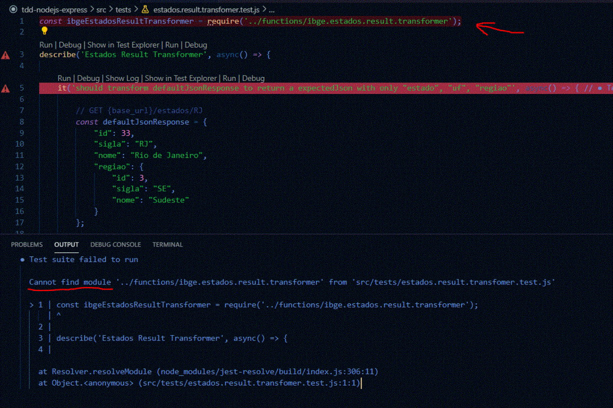
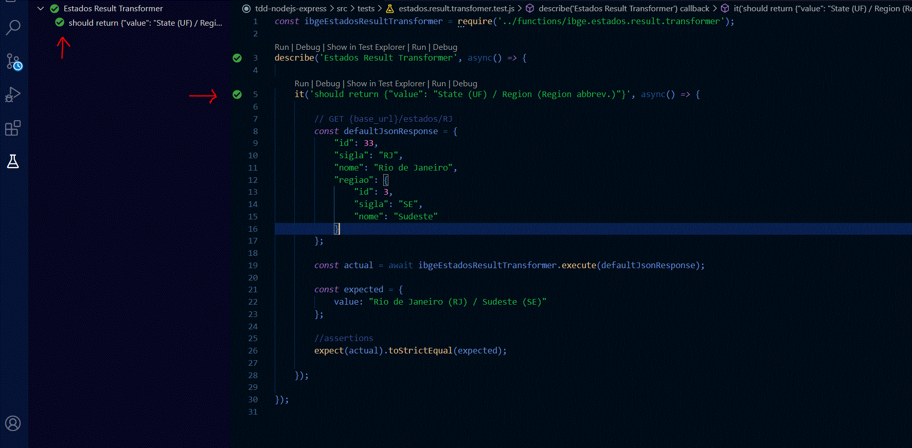

## TDD NODEJS EXPRESS

#### This is a NodeJS application that provides exercises in a gradative way to improve your test skills using TDD practice

### Content

- [Motivation](#motivation)
- [Technologies](#technologies)
- [VSCode Extensions](#vscode-extensions)
- [Main Structure](#main-structure)

### Motivation

Many developers are little lazy when the subject it's about tests. Maybe they don't REALLY know about the importance of this, or they just don't know how to create good tests. Or even worse, they don't know how to start build a test nicely.

This guide it's for you, my dear Dev, and I hope that you leave with some skills to build tests like a good Dev.

We'll follow this simple image that represents the cycle of TDD and see how it works in the practice.


### Technologies

- axios
- consign
- express
- pino

- jest (dev)
- supertest (dev)
- @types/jest (dev)

### VSCode Extensions

- ESLint
- JavaScript (ES6) code snippets
- Jest Runner
- Jest Test Explorer

>**IT'S VERY RECOMMENDED INSTALL THIS EXTENSIONS TO HAVE A BETTER EXPERIENCE**

### Main Structure

>**TO DO**

## Let's Start !

### The context
We'll create services with integration to IBGE API, a public institute of Brazil. The API that we'll use treats about informations of locations (states and regions).

##### BASE_URL (The base url of API)
https://servicodados.ibge.gov.br/api/v1/localidades

##### ESTADOS BY UF (To see the full list, call GET <a>/estados</a>)
GET <a>/estados/{UF}</a>

##### MUNICIPIOS (The regions of a state)
GET <a>/estados/{UF}/municipios</a>

> The BASE_URL it's already created with Axios plugin. Don't worry about that and focus on the below specifications.

##### [See more ESTATOS](https://servicodados.ibge.gov.br/api/docs/localidades?versao=1#api-UFs-estadosUFGet)

##### [See more MUNICIPIOS](https://servicodados.ibge.gov.br/api/docs/localidades?versao=1#api-Municipios-estadosUFMunicipiosGet)**

### Exercise One

Create a service that will integrate with **/estados/{UF}** and than transform the default response of service to return on the below format:

#### **Example**
**GET <a>{base_url}/estados/RJ</a>**

**Default Response**
```json
{
    "id": 33,
    "sigla": "RJ",
    "nome": "Rio de Janeiro",
    "regiao": {
        "id": 3,
        "sigla": "SE",
        "nome": "Sudeste"
    }
}
```
**The new format response that must be transformed**
```json
{
    "estado": "Rio de Janeiro",
    "uf": "RJ",
    "regiao": "Sudeste"
}
```

> NOTE: <br>
> You have to:
> * Create a function with the transformer
> * Create a client/service that integrate with API, and then call the above transformer to manipulate the response correctly

### WRITING THE TEST

#### Step 1

Create a test file named **estados.result.transformer.test.js** on the **tests** folder.


#### Step 2

**Describe the Test Suite**
```javascript
describe('Estados Result Transformer', async() => {

    
});
```

#### Step 3

**Create the test**
```javascript
describe('Estados Result Transformer', async() => {

    it('should return a json with only "estado", "uf", "regiao"', async() => {

    });

});
```

#### Step 4

**Create a "*mock value*" that represents the real return of IBGE API ESTADOS**
```javascript
describe('Estados Result Transformer', async() => {

    it('should transform defaultJsonResponse to return a expectedJson with only "estado", "uf", "regiao"', async() => {

        // GET {base_url}/estados/RJ
        const defaultJsonResponse = {
            "id": 33,
            "sigla": "RJ",
            "nome": "Rio de Janeiro",
            "regiao": {
                "id": 3,
                "sigla": "SE",
                "nome": "Sudeste"
            }
        };

    });
});
```

#### Step 5

**Invoke a function (function, method, class, service... whatever you want) that will be return the expected transformation of response**

>***Yes! This function still not exists. Yet. And that is the trick.***

```javascript
describe('Estados Result Transformer', async() => {

    it('should transform defaultJsonResponse to return a expectedJson with only "estado", "uf", "regiao"', async() => {

        // GET {base_url}/estados/RJ
        const defaultJsonResponse = {
            "id": 33,
            "sigla": "RJ",
            "nome": "Rio de Janeiro",
            "regiao": {
                "id": 3,
                "sigla": "SE",
                "nome": "Sudeste"
            }
        };


        //this service doesn't exists yet
        const result = ibgeEstadosResultTransformer.execute(defaultJsonResponse);


    });
});
```

#### Step 6

**We need to create the assertions to validate the expected result of what we want.**

```javascript
describe('Estados Result Transformer', async() => {

    it('should transform defaultJsonResponse to return a expectedJson with only "estado", "uf", "regiao"', async() => {

        // GET {base_url}/estados/RJ
        const defaultJsonResponse = {
            "id": 33,
            "sigla": "RJ",
            "nome": "Rio de Janeiro",
            "regiao": {
                "id": 3,
                "sigla": "SE",
                "nome": "Sudeste"
            }
        };

        //this service doesn't exists yet
        const result = ibgeEstadosResultTransformer.execute(defaultJsonResponse);

        //assertions
        expect(result.estado).toBe('Rio de Janeiro');
        expect(result.uf).toBe('RJ');
        expect(result.regiao).toBe('Sudeste');

    });
});
```

#### *We expect that "result" variable represents the new formated json containing the attributes "estado", "uf", "regiao" with the specification on the above "Exercise One"*

#### **AT THIS POINT, WE CREATE THE STEP "1. Write Test" OF THE TDD CYCLE. NOW, WE GO ENTER ON THE STEP 2.**

### RUNNING THE TEST "2. Test Fails" 

If you install the above extensions recommended, this panel will show the described test (and all tests created by you).

Click on the left side bar icon to show the panel.


**RUN IT on the play icon.**

#### **WOW! ERROR! OF COURSE.** 


>An error occurs: *"ReferenceError: ibgeEstadosResultTransformer is not defined"*.

**And that it's right. So, let's create this reference.**

```javascript
const ibgeEstadosResultTransformer = require('../functions/ibge.estados.result.transformer');

describe('Estados Result Transformer', async() => {

    // ...

});
```

**RUN THE TEST AGAIN**

#### **ERROR! ONCE AGAIN!** 



>But it's another error. The module that we required doesn't exist.

#### **Let's create this module. BUT with no logic, for now.**

### NOW WE START TO ENTER THE STEP 3 "Write Code"

#### To see how it works gradatively, we'll iterate on the step's 2 and 3. Write some code. Test this code. And repeat again.


**Content of file ibge.estados.result.transformer.js**

```javascript
const ibgeEstadosResultTransformer = {

    async execute(ibgeEstadoResponseJson){

    }

};

module.exports = ibgeEstadosResultTransformer;
```

**RUN THE TEST ONE MORE TIME**

#### **OPS! WAIT A MINUTE!** 


> Now the error occurs inside our test. Look the first assertion (on the 23 line) and look the Error trace. <br>
>*"Error: expect(received).toBe(expected) // Object.is equality <br><br>
>Expected: "Rio de Janeiro"<br>
>Received: undefined"*

**It's almost there. Let's create THE LOGIC OF OUR CONTEXT (on the description of Exercise One).**

```javascript
const ibgeEstadosResultTransformer = {

    async execute(ibgeEstadoResponseJson){

        const newJsonTransformed = {};

        newJsonTransformed.estado = ibgeEstadoResponseJson.nome;
        newJsonTransformed.uf = ibgeEstadoResponseJson.sigla;
        newJsonTransformed.regiao = ibgeEstadoResponseJson.regiao.nome;

        return newJsonTransformed;
    }
};
module.exports = ibgeEstadosResultTransformer;
```

**AND BEFORE WE RUN THE TEST AGAIN, UPDATE THE 20 LINE OF OUR TEST TO INCLUDE THE "AWAIT" INSTRUCTION:**

```javascript
    const result = await ibgeEstadosResultTransformer.execute(defaultJsonResponse);
```

**IT'S NECESSARY, SINCE WE HAVE CREATED ASYNC FUNCTIONS. SO FINALLY, RUN THE FINAL TEST**

### *AND VOILÀ ! ! !*



**THE GREEN LIGHT SHOW US THAT THE TEST PASS SUCCESSFULLY**

#### *AT THIS POINT, WE ARE ON THE STEP 4 "Test Passes".*

>To check if it's all good, try to change the line 23 to this:<br>

```javascript
expect(result.estado).toBe('Rio de Janeiroooo');
```

**The test will fail.**

### IF YOU FEEL IT'S NECESSARY TO REFACTOR YOUR LOGIC CODE, AND THE TEST CODE, DO IT! IT'S IMPORTANT MAINTAINING A CLEAN CODE*


> TO DO

3: |Retornar o somatorio de estados agrupados por regiao|
## EXEMPLO ##

[
    {
        "regiao": "Sudeste",
        "qtdEstados": 999
    },
    {
        "regiao": "Norte",
        "qtdEstados": 111
    }
]


> TO DO
4: |Dada uma UF, retornar o nome do estado dentro de um array. cada posicao do array deve conter uma letra|

## EXEMPLO ##
GET /endpoint/RJ

["r", "i", "o", " ", "d", "e", " ", "j", "a", "n", "e", "i", "r", "o" ]