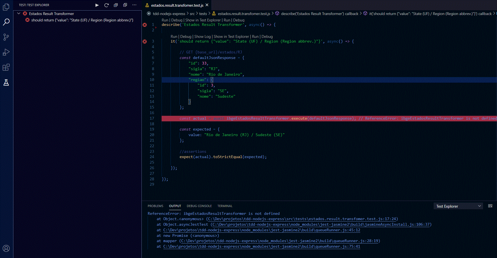

## TDD NODEJS EXPRESS

#### This is a NodeJS application that provides exercises in a gradative way to improve your test skills using TDD practice

### Content

- [Motivation](#motivation)
- [Technologies](#technologies)
- [VSCode Extensions](#vscode-extensions)
- [Main Structure](#main-structure)

### Motivation

Many developers are little lazy when the subject it's about tests. Maybe they don't REALLY know about the importance of this, or they just don't know how to create good tests. Or even worse, they don't know how to start build a test nicely.

This guide it's for you, my dear Dev, and I hope that you leave with some skills to build tests like a good Dev.

We'll follow this simple image that represents the cycle of TDD and see how it works in the practice.


### Technologies

- axios
- consign
- express
- pino

- jest (dev)
- supertest (dev)
- @types/jest (dev)

### VSCode Extensions

- ESLint
- JavaScript (ES6) code snippets
- Jest Runner
- Jest Test Explorer

>**IT'S VERY RECOMMENDED INSTALL THIS EXTENSIONS TO HAVE A BETTER EXPERIENCE**

### Main Structure

>**TO DO**

## Let's Start !

### The Context
A client asked us to create an service exposed as an API to let us know which region is located in a Brazilian state. Our service must receive the UF (Federative Unit) and return the exactly value "Rio de Janeiro (RJ) - Sudeste".

### The Solution

We'll use the IBGE API `https://servicodados.ibge.gov.br/api/v1/localidades/estados/{UF}` to return the information of a UF. After that, we need to convert the IBGE API response to the specification above.

#### **Example**
**GET <a>https://servicodados.ibge.gov.br/api/v1/localidades/estados/RJ</a>**

**IBGE API Response (States)**
```json
{
    "id": 33,
    "sigla": "RJ",
    "nome": "Rio de Janeiro",
    "regiao": {
        "id": 3,
        "sigla": "SE",
        "nome": "Sudeste"
    }
}
```
**Our service MUST RETURN**
```json
{
    "value": "Rio de Janeiro (RJ) / Sudeste (SE)"
}
```

##### [To see more](https://servicodados.ibge.gov.br/api/docs/localidades?versao=1#api-UFs-estadosUFGet)

#### **NOTE:**
> When we look at the describe of the Solution, automatically we think "well, i need to create a client that integrates with the IBGE API and after that transform the result on a new one". Yes, that it's correct. Then we would do:
> 1. Create a client that integrates with API
> 2. Create a function with the logic of transformer/converter of IBGE API response
> 3. Create a module that integrates the items 1 and 2. So, when we use this module, we call the API with ***item 1*** and then transform the result with ***item 2***
>
> **So far so good.**
>
> But what is the real value, or in other words, what is the business rules here that we need to **pay attention**?
><br>
><br>
><br>
> I'm sure you answered: Transformer!

### **DEEP DIVING**

### 1- WRITING THE TEST FOR THE TRANSFORMER

#### Step 1

Create a test file named **estados.result.transformer.test.js** on the **tests** folder.


#### Step 2

**Describe the Test Suite**
```javascript
describe('Estados Result Transformer', async() => {

    
});
```

#### Step 3

**Create the test**
```javascript
describe('Estados Result Transformer', async() => {

    it('should return a json with the value "State (State abbreviation) / Region (Region abbreviation)"', async() => {

    });

});
```

#### Step 4

**Create a "*mock value*" that represents the real return of IBGE API ESTADOS**
```javascript
describe('Estados Result Transformer', async() => {

    it('should return a json with the value "State (State abbreviation) / Region (Region abbreviation)"', async() => {

        // GET {base_url}/estados/RJ
        const defaultJsonResponse = {
            "id": 33,
            "sigla": "RJ",
            "nome": "Rio de Janeiro",
            "regiao": {
                "id": 3,
                "sigla": "SE",
                "nome": "Sudeste"
            }
        };

    });
});
```

#### Step 5

**Invoke a function (function, method, class, service... whatever you want) that will be return the expected transformation of response**

>***Yes! This function still not exists. Yet. And that is the trick.***

```javascript
describe('Estados Result Transformer', async() => {

    it('should return a json with the value "State (State abbreviation) / Region (Region abbreviation)"', async() => {

        // GET {base_url}/estados/RJ
        const defaultJsonResponse = {
            "id": 33,
            "sigla": "RJ",
            "nome": "Rio de Janeiro",
            "regiao": {
                "id": 3,
                "sigla": "SE",
                "nome": "Sudeste"
            }
        };


        //this service doesn't exists yet
        const result = ibgeEstadosResultTransformer.execute(defaultJsonResponse);


    });
});
```

#### Step 6

**We need to create the assertions to validate the expected result of what we want.**

```javascript
describe('Estados Result Transformer', async() => {

    it('should return a json with the value "State (State abbreviation) / Region (Region abbreviation)"', async() => {

        // GET {base_url}/estados/RJ
        const defaultJsonResponse = {
            "id": 33,
            "sigla": "RJ",
            "nome": "Rio de Janeiro",
            "regiao": {
                "id": 3,
                "sigla": "SE",
                "nome": "Sudeste"
            }
        };

        //this service doesn't exists yet
        const result = ibgeEstadosResultTransformer.execute(defaultJsonResponse);

        //assertions
        expect(result.value).toBe('Rio de Janeiro (RJ) / Sudeste (SE)');

    });
});
```

#### *We expect that "result" variable represents the new formated json containing the format of the above specification*

#### **AT THIS POINT, WE CREATE THE STEP "1. Write Test" OF THE TDD CYCLE. NOW, WE GO ENTER ON THE STEP 2.**

### RUNNING THE TEST "2. Test Fails" 

If you install the above extensions recommended, this panel will show the described test (and all tests created by you).

Click on the left side bar icon to show the panel.


**RUN IT on the play icon.**

#### **WOW! ERROR! OF COURSE.** 



>An error occurs: *"ReferenceError: ibgeEstadosResultTransformer is not defined"*.

**And that it's right. So, let's create this reference.**

```javascript
const ibgeEstadosResultTransformer = require('../functions/ibge.estados.result.transformer');

describe('Estados Result Transformer', async() => {

    // ...

});
```

**RUN THE TEST AGAIN**

#### **ERROR! ONCE AGAIN!** 


>But it's another error. The module that we required doesn't exist.

#### **Let's create this module. BUT with no logic, for now.**

### NOW WE START TO ENTER THE STEP 3 "Write Code"

#### To see how it works gradatively, we'll iterate on the step's 2 and 3. Write some code. Test this code. And repeat again.


**Content of file ibge.estados.result.transformer.js**

```javascript
const ibgeEstadosResultTransformer = {

    async execute(ibgeEstadoResponseJson){

    }

};

module.exports = ibgeEstadosResultTransformer;
```

**RUN THE TEST ONE MORE TIME**

#### **OPS! WAIT A MINUTE!** 


> Now the error occurs inside our test. Look the first assertion (on the 23 line) and look the Error trace. <br>
>*"Error: expect(received).toBe(expected) // Object.is equality <br><br>
>Expected: "Rio de Janeiro"<br>
>Received: undefined"*

**It's almost there. Let's create THE LOGIC OF OUR CONTEXT (on the description of Exercise One).**

```javascript
const ibgeEstadosResultTransformer = {

    async execute(ibgeEstadoResponseJson){

        const newJsonTransformed = {};

        //ex: 'Rio de Janeiro (RJ) / Sudeste (SE)'

        const estado = ibgeEstadoResponseJson.nome;
        const uf = ibgeEstadoResponseJson.sigla;
        const regiao = ibgeEstadoResponseJson.regiao.nome;
        const regiaoSigla = ibgeEstadoResponseJson.regiao.sigla;

        return `${estado} (${uf}) / ${regiao} (${regiaoSigla})`;
    }

};

module.exports = ibgeEstadosResultTransformer;
```

**AND BEFORE WE RUN THE TEST AGAIN, UPDATE THE 20 LINE OF OUR TEST TO INCLUDE THE "AWAIT" INSTRUCTION:**

```javascript
    const result = await ibgeEstadosResultTransformer.execute(defaultJsonResponse);
```

**IT'S NECESSARY, SINCE WE HAVE CREATED ASYNC FUNCTIONS. SO FINALLY, RUN THE FINAL TEST**

### *AND VOILÀ ! ! !*


**THE GREEN LIGHT SHOW US THAT THE TEST PASS SUCCESSFULLY**

#### *AT THIS POINT, WE ARE ON THE STEP 4 "Test Passes".*

>To check if it's all good, try to change the line 23 to this:<br>

```javascript
expect(result.value).toBe('lorem');
```

**The test will fail.**

### IF YOU FEEL IT'S NECESSARY TO REFACTOR YOUR LOGIC CODE, AND THE TEST CODE, DO IT! IT'S IMPORTANT MAINTAINING A CLEAN CODE*


### 2- WRITING THE TEST FOR THE API CLIENT INTEGRATION

#### Step 1

Follow the above steps to create a test file named **estados.client.integration.test.js** on the **tests** folder.


#### Step 2

**Describe the Test Suite**
```javascript
describe('Estados Result Transformer', async() => {

    
});
```


> TO DO

3: |Retornar o somatorio de estados agrupados por regiao|
## EXEMPLO ##

[
    {
        "regiao": "Sudeste",
        "qtdEstados": 999
    },
    {
        "regiao": "Norte",
        "qtdEstados": 111
    }
]


> TO DO
4: |Dada uma UF, retornar o nome do estado dentro de um array. cada posicao do array deve conter uma letra|

## EXEMPLO ##
GET /endpoint/RJ

["r", "i", "o", " ", "d", "e", " ", "j", "a", "n", "e", "i", "r", "o" ]